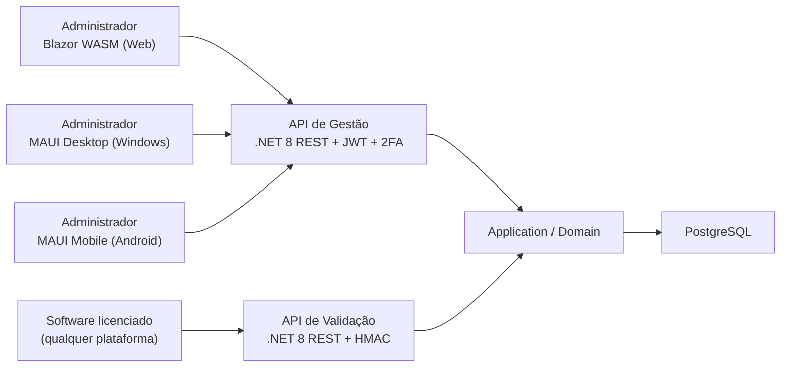
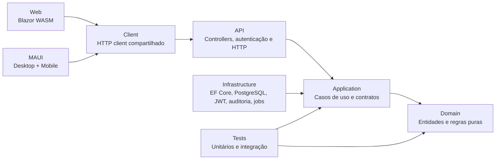

# Arquitetura

## Objetivo

Construir uma plataforma multi-interface (web, desktop e mobile) e uma API de gestão/validação de licenças. Cada empresa cliente administra seus usuários, clientes finais, softwares e licenças a partir de qualquer interface, enquanto os softwares licenciados consultam uma API de validação. As regras devem ser testáveis, seguras e separadas entre interface, aplicação, domínio e persistência.

## Fronteiras do produto



- O administrador acessa o sistema por três interfaces — web (Blazor WASM), desktop (MAUI Windows) e mobile (MAUI Android) — com paridade funcional entre elas.
- As três interfaces consomem a **mesma API REST de gestão**; não há BFF separado por interface.
- A **API de validação** é consumida pelos softwares licenciados e não expõe operações administrativas.
- Um administrador só enxerga e altera dados do próprio cliente/tenant.
- Lógica de cliente HTTP e modelos de resposta são compartilhados entre Web e MAUI via biblioteca comum (`LicenciamentoSoftware.Client`).

## Estilo arquitetural

Será adotada **Clean Architecture** com casos de uso por agregado, seguindo SOLID, Clean Code e TDD. A arquitetura não usará serviço ou repositório genérico que concentre todos os CRUDs.



### Regra de dependências

| Projeto | Pode depender de |
|---|---|
| `Domain` | Nenhum projeto da solução |
| `Application` | `Domain` |
| `Infrastructure` | `Application`, `Domain` |
| `Api` | `Application`, `Infrastructure` |
| `Client` | Contratos públicos da `Api` (DTOs) |
| `Web` | `Client` |
| `Web.Server` | `Client`, `Web` (serve os arquivos estáticos) |
| `Maui` | `Client` |
| `Tests` | Projeto testado e bibliotecas de teste |

`Domain` e `Application` não conhecem EF Core, PostgreSQL, controllers, `HttpContext` ou detalhes de autenticação.

## Organização da solução

```text
src/
  LicenciamentoSoftware.Domain/
    Entities/ ValueObjects/ Rules/
  LicenciamentoSoftware.Application/
    Clientes/ Usuarios/ ClientesFinais/ Aplicacoes/ Licencas/ Validacao/
    Abstractions/ Validation/ Behaviors/
  LicenciamentoSoftware.Infrastructure/
    Persistence/ Repositories/ Security/ BackgroundJobs/ Auditing/
  LicenciamentoSoftware.Api/
    Controllers/ Contracts/ Middleware/ Configuration/
  LicenciamentoSoftware.Client/
    Contracts/ Services/ Authentication/
  LicenciamentoSoftware.Web/
    Pages/ Components/ Authentication/ Layout/
  LicenciamentoSoftware.Maui/
    Pages/ Components/ Authentication/ Platforms/
tests/
  LicenciamentoSoftware.Domain.Tests/
  LicenciamentoSoftware.Application.Tests/
  LicenciamentoSoftware.IntegrationTests/
```

Cada pasta de caso de uso terá seus próprios comandos, consultas, validador, handler e interface de repositório. Exemplo:

```text
Application/Clientes/
  CriarClienteCommand.cs
  CriarClienteValidator.cs
  CriarClienteHandler.cs
  IClienteRepository.cs
```

## Responsabilidades

### Domain

- Entidades, invariantes e tipos de licença.
- Métodos com intenção de negócio: `Desativar`, `AtualizarDados`, `CriarSessao`, `EncerrarSessao`.
- Não aceita limites negativos, datas inválidas ou entidades em estado inconsistente.
- Sem dependência de EF Core, HTTP ou qualquer infraestrutura.

### Application

- Orquestra casos de uso por agregado.
- Valida comandos antes de persistir (FluentValidation).
- Depende de portas pequenas e específicas: `IClienteRepository`, `ILicencaRepository`, `IAuditLogWriter`, `IClock`, `ICurrentUser`.
- Retorna resultados explícitos (`Result`, `NotFound`, `Conflict`, `ValidationError`) — sem tipos HTTP.

### Infrastructure

- Implementa PostgreSQL/Dapper, repositórios, transações, JWT, TOTP, HMAC, persistência de auditoria, jobs agendados e envio de e-mail.
- Implementa controle de concorrência de licença dentro de transação serializável.
- `SmtpEmailService` (MailKit): envia e-mails com corpo HTML gerado pelo `TemplateRenderer`.
- `TemplateRenderer`: lê templates HTML embarcados como `EmbeddedResource` e substitui placeholders `{{Chave}}`.
- `JobScheduler`: `BackgroundService` que executa cada `IScheduledJob` em escopo de DI independente.
- Não contém regra de negócio testável sem banco ou servidor externo.

### Api

- Mapeia request/response HTTP para comandos/resultados.
- Configura DI, autenticação JWT + 2FA, autorização por políticas, rate limiting, tratamento global de erros e OpenAPI.
- Controllers não acessam `DbContext` e não decidem regras de negócio.

### Client

- Biblioteca compartilhada entre `Web` e `Maui`.
- Clientes HTTP tipados para todos os endpoints da API de gestão.
- Gerenciamento de token JWT, refresh e estado de autenticação.
- Modelos de request/response (DTOs) compartilhados.

### Web (Blazor WASM + BFF)

O frontend é composto por dois projetos que trabalham juntos:

**`LicenciamentoSoftware.Web.Server` (BFF — Backend for Frontend)**
- ASP.NET Core que serve os arquivos estáticos do Blazor WASM.
- Endpoints `/bff/login`, `/bff/login/2fa`, `/bff/refresh`, `/bff/logout`, `/bff/cadastrar`.
- Emite e gerencia cookie `HttpOnly; Secure; SameSite=Strict` com o refresh token.
- Proxy reverso YARP para todos os endpoints da API — o browser nunca chama a API diretamente.
- O access token JWT fica em memória no Blazor WASM e é propagado automaticamente pelo YARP.

**`LicenciamentoSoftware.Web` (Blazor WASM Client)**
- Roda 100% no browser via WebAssembly.
- `JwtAuthStateProvider`: access token exclusivamente em memória C# — nunca toca localStorage.
- `BearerTokenHandler`: adiciona `Authorization: Bearer` em todas as requisições autenticadas.
- `TokenRefreshHandler`: intercepta 401, chama `/bff/refresh` e retenta automaticamente.
- Proteção de rotas via `AuthorizeRouteView`; sem token redireciona para `/login`.
- Todos os formulários (criar/editar/emitir) são modais inline — sem páginas separadas de formulário.
- Badges coloridos por tipo de licença; botão "Copiar" com feedback visual nos tokens HMAC.

### Maui (Desktop + Mobile)

- Projeto único com targets Windows e Android.
- Consome `Client` para todas as chamadas à API.
- Armazenamento seguro de token via `SecureStorage`.
- UX adaptada para toque (mobile) e mouse/teclado (desktop).
- Distribuição: instalador para Windows, Google Play para Android.

## Segurança

### API de gestão

- Autenticação JWT obrigatória para todas as operações administrativas.
- Fluxo de login: `POST /auth/login` → validação de credenciais → se 2FA habilitado, exige código TOTP → emite JWT + refresh token.
- 2FA via TOTP (Google Authenticator / Authy); segredo gerado na ativação, armazenado como hash.
- O primeiro usuário que cadastra uma empresa recebe o papel `AdministradorCliente`.
- Autorização por políticas: `AdministradorPlataforma`, `AdministradorCliente`, `OperadorCliente`, `Leitor`.
- O tenant (`IdCliente`) vem **sempre** da identidade autenticada (`ICurrentUser`); nunca do corpo da requisição.
- Refresh token rotacionável, armazenado apenas como hash, com revogação individual ou total.
- Toda alteração registra usuário autenticado no log de auditoria.

### API de validação

- Cada licença possui um **token próprio** gerado na emissão, com expiração automática configurável.
- O token é armazenado apenas como hash; o valor em texto claro é exibido uma única vez na emissão.
- Autenticação por **assinatura HMAC-SHA256** com timestamp: o software assina cada requisição com o token da licença, incluindo um timestamp. O servidor rejeita requisições com timestamp fora de uma janela de ±5 minutos (proteção anti-replay).
- Token renovável pelo portal pelo `AdministradorCliente`; o token anterior é invalidado imediatamente.
- Rate limiting por IP e por token nos endpoints de validação.

### Medidas transversais

- Segredos somente por variáveis de ambiente ou cofre de segredos; nunca no repositório.
- Validação de entrada em toda operação de escrita.
- Mensagens de erro seguras — sem stack trace ou detalhes internos em produção.
- Logs estruturados sem expor credenciais ou tokens.

## Persistência e consistência

- PostgreSQL e migrations EF Core são a única fonte de schema; scripts SQL são gerados a partir das migrations.
- Exclusão sempre lógica (`Ativo = false`); a validação exige licença, cliente, cliente final e aplicação ativos.
- `ClienteFinal` e `Aplicacao` devem pertencer ao mesmo cliente da licença.
- O tipo da aplicação não pode mudar enquanto houver licenças ativas.
- Licença por período exige `DataInicio < DataFim`.
- Limites de usuários, sessões e instalações devem ser inteiros positivos.
- Controle de capacidade é atômico: transação serializável por licença. Uma consulta seguida de insert não é suficiente.

## Casos de uso de gestão

### Cadastro e manutenção

- Cadastro de empresa/cliente e do primeiro administrador.
- Cadastro, listagem, edição, ativação/desativação de usuários do cliente.
- Cadastro e manutenção de clientes finais.
- Cadastro e manutenção de softwares/aplicações, incluindo seu tipo de licença.
- Emissão de licença que vincula cliente final + software; o tenant é obtido da identidade autenticada.
- Consulta, edição e desativação de licenças.

### Manutenção de licenças

As operações abaixo têm endpoints próprios, confirmação na interface, auditoria e autorização de `AdministradorCliente`:

| Operação | Efeito |
|---|---|
| Encerrar sessão de usuário | Marca `LicencaSessao` como inativa e libera a vaga imediatamente. |
| Limpar sessões inativas | Encerra sessões sem heartbeat além do limite. Manual ou via job. |
| Liberar instalação | Desativa máquina registrada para permitir nova ativação. |
| Renovar licença por período | Atualiza `DataFim` quando renovação não é automática. |
| Desabilitar licença | Marca licença como inativa e impede novas validações. |
| Renovar token de licença | Gera novo token HMAC, invalida o anterior imediatamente. |

As telas de manutenção mostram histórico de sessões, instalações e alterações; nunca apagam registros físicos.

## Auditoria, jobs e e-mail

- Auditoria é porta da aplicação, persistida de forma transacional junto da alteração.
- Jobs rodam como `BackgroundService` com `PeriodicTimer` individual por job. A interface `IScheduledJob` permite migração futura para Hangfire/Quartz sem impacto no domínio.
- **Jobs implementados:** `EncerrarSessoesInativasJob`, `ExpirarLicencasPeriodoJob`, `RenovarLicencasAutomaticasJob`, `RotacionarTokensLicencaJob`, `NotificarExpiracaoJob`.
- `JobScheduler` (BackgroundService) orquestra todos os jobs via `PeriodicTimer` independente por job, com escopo de DI criado por execução.
- Intervalos e limites configuráveis via seção `JobSettings` no `appsettings.json`.
- Notificações por e-mail via MailKit (SMTP). Templates HTML embarcados no assembly como `EmbeddedResource`. `IEmailService` e `IEmailTemplateRenderer` são portas da Application; `SmtpEmailService` e `TemplateRenderer` são implementações da Infrastructure.
- Envio de e-mail desabilitado por padrão (`EmailSettings:Habilitado = false`); ativado via secrets ou variáveis de ambiente.

## Estratégia de testes

- **Unitários:** domínio e handlers da aplicação com xUnit + FluentAssertions. Ciclo Red → Green → Refactor.
- **Integração:** EF Core/PostgreSQL real via Testcontainers, migrations e repositórios.
- **API:** `WebApplicationFactory`, autenticação simulada e códigos HTTP.
- **Concorrência:** testes paralelos para o último slot de usuário/instalação disponível.
- Nenhuma regra de negócio nova entra sem teste automatizado correspondente.
- Nomes de teste no formato: `Metodo_Cenario_ResultadoEsperado`.

## Infraestrutura de hospedagem

| Componente | Hospedagem recomendada |
|---|---|
| Blazor WASM (Web) | GitHub Pages (arquivos estáticos) |
| API de gestão + validação | Oracle Cloud VM (Always Free) ou Railway/Render |
| PostgreSQL | Supabase (gerenciado, gratuito) ou VM Oracle separada |
| MAUI Desktop | Instalador distribuído diretamente |
| MAUI Mobile | Google Play Store |
